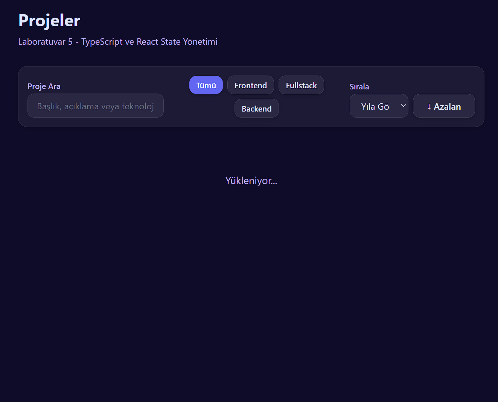
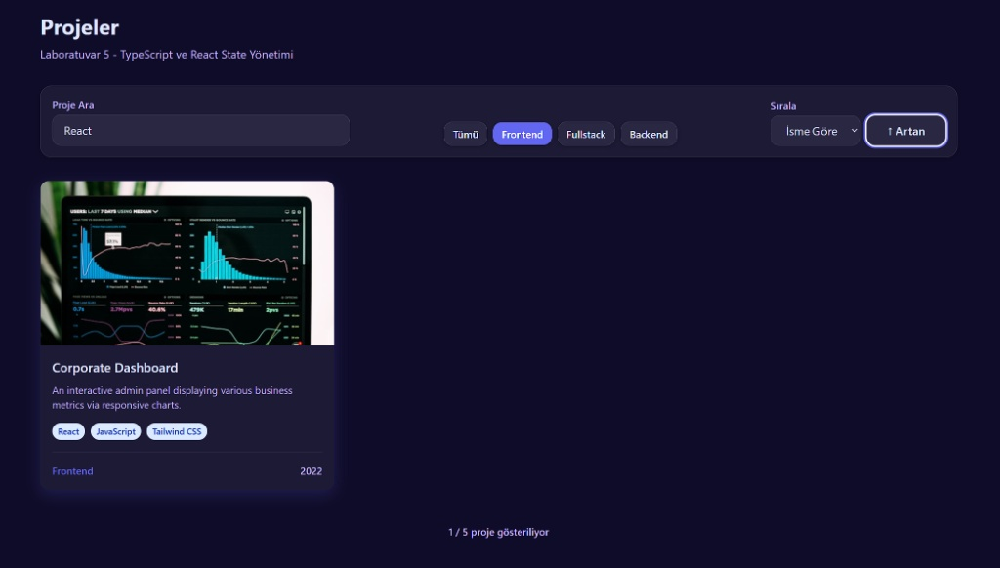
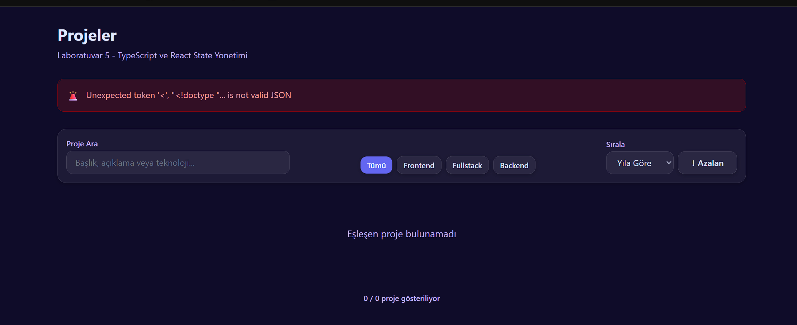

# 🚀 Web Tasarımı ve Programlama — Kişisel Portföy


## 📖 Hakkında
Bu proje, **Web Tasarımı ve Programlama** dersi laboratuvar görevleri kapsamında modüler olarak geliştirilen, kişisel bir portföy ve proje yönetim arayüzüdür. Modern web teknolojileriyle, **strict typing**, üstün **UI/UX** pratikleri ve **State Management** kurallarına uyarak tasarlanmıştır.

## 👨‍💻 Geliştirici
- **Ad Soyad:** Ömer Can Gümüş
- **Öğrenci No:** 245541008
- **Bölüm:** Yazılım Mühendisliği
- **Üniversite:** Fırat Üniversitesi

---

## ✨ Özellikler ve Modüller

### 📌 LAB-5: TypeScript Temelleri ve Gelişmiş State Yönetimi (Güncel)
Projenin son aşamasında asenkron veri akışı ve strict typing yetenekleri kazandırılmıştır.
- **Tip Güvenliği:** Proje genelinde `any` tipi kullanımları sıfırlanmış, `interface` ve `type` ile güçlü modeller yazılmıştır.
- **Mock Service & Fetch:** `projects.json` mock verisinden asenkron `fetchProjects` servisi aracılığıyla hata (`!response.ok`) denetimli veri çekimi yapılmıştır.
- **Derived State & Pure Functions:** Veriler orijinal diziyi bozmadan (immutability) pure fonksiyonlarla frontend tarafında aranabilir ve sırlanabilir hale getirilmiştir.
- **Reaktif UI:** Hiçbir DOM manipülasyonu olmadan tüm akış React Hook'ları (`useState`, `useEffect`) ile yönetilmiştir.

### 🎨 LAB-4: Tailwind CSS & UI Component Mimarisi
Eski geleneksel CSS sistemleri kaldırılarak Tailwind CSS v4'e göç edilmiş, `Button`, `Input`, `Card`, `Alert` gibi tekrar kullanılabilir (reusable) UI bileşenleri yazılmış ve özel bir `/UIKit` ekranı kurulmuştur. (Karanlık/Aydınlık mod dahil)

### 📏 LAB-3 & LAB-2: Responsive Layout, Semantik HTML ve Erişilebilirlik
HTML5 semantik etiketleri ile inşa edilen proje, `clamp()` fluid tipografi, CSS Grid ve Flexbox ile tasarlanmış olup 3 farklı breakpoint (Mobil, Tablet, Masaüstü) için kusursuz responsive akış sunar. Erişilebilirlik puanı %100'dür.

---

## 📸 Ekran Görüntüleri

### ⏳ Yükleniyor Durumu (Loading State)
Asenkron işlemler sırasında kullanıcıya gösterilen bekleme arayüzü.



### 🔍 Filtreleme ve Arama (Filtered State)
Canlı çalışan React State bazlı arama ve teknoloji kategorizasyonu.



### 🚨 Hata Yönetimi (Error State)
Fetch sırasında oluşabilecek ağ ve sunucu problemlerinde Alert component'inin devreye girmesi.



---

## 🛠️ Kurulum ve Çalıştırma

Projeyi yerel bilgisayarınızda çalıştırmak için:

```bash
# Bağımlılıkları yükleyin
npm install

# Geliştirme sunucusunu başlatın
npm run dev
```

## 📜 Lisans
Bu proje eğitim amaçlı oluşturulmuştur.
